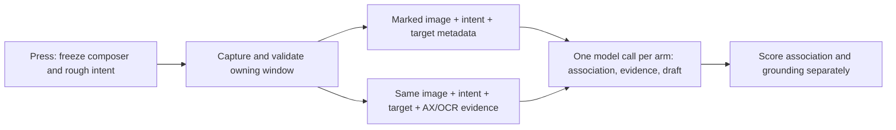

# Decision: composer-bound visual baseline, measured hybrid challenger

Recommend **A as the first base layer**: freeze the exact composer and rough intent using AX, capture its window, mark that composer in the image, then make one multimodal call that returns both a draft and a small grounding record. Test **B against those same captures**, adding local OCR and bounded AX evidence. Introduce **C only for reproducible, app-specific residual failures**. This chooses the next experiment, not a proven shipping architecture.

This narrows the earlier report's hybrid-first recommendation. The Willow investigation establishes multiple implemented acquisition capabilities, but does not establish that all are necessary for our operation. Starting with mandatory extraction, normalization, scoring and generation would add several failure boundaries before measuring whether one visual call is sufficient.

Inspected working tree: `9eeeeb5`, plus the parked automatic-context interpreter in `/private/tmp/keigo-reply-experiment`. Only this decision document was added. No application code, release switches, provider configuration or deployment changed; no conversations were uploaded or new runtime tests performed.

**Evidence behind the decision**

- The [original investigation](/Users/itsuki/Desktop/key/laptop/docs/reports/no-extension-context-architecture.md) distinguishes fixed traversal defects from remaining completeness and grouping failures. Its Gmail replay retained useful body text but stopped before a provider call; offline normalization produced 34 unresolved singleton turns. That is evidence against making the old generic AX interpretation pipeline a prerequisite.
- The [Willow static investigation](/Users/itsuki/Desktop/key/laptop/docs/reports/willow-scribe-investigation.md) directly identifies ScreenCaptureKit capture, AX/app extractors, image transmission and local Vision OCR. Per-request routing and the cloud model remain unverified. Its implementation is evidence that complementary channels are practical, not evidence that a particular sequence is required.
- The [manual trials](/Users/itsuki/Desktop/key/laptop/docs/reports/willow-scribe/live-results.md) show wrong-topic Slack replies for a user-reported right-thread destination, followed by a successful trial under changed conditions. They support evaluating **composer association separately from text recovery**. They do not isolate the failed internal stage.
- LinkedIn's clipped/visible pair supports visibility-sensitive recovery, with wording/session changes as confounds. Our initial product boundary should be enough currently available context for the requested reply, with explicit uncertainty when required context is missing.

| Direction | What it tests | Main liability | Decision |
| --- | --- | --- | --- |
| A: marked window + exact intent + target metadata | Whether visual understanding can bind the composer and write a grounded reply without local message reconstruction | Wrong-pane selection, small-text reading, attribution and model variability | First base layer |
| B: A + OCR boxes/text + bounded AX evidence | Whether explicit text and structure correct A's errors at acceptable latency | Conflicting/duplicated evidence, more capture work, new association mistakes | Paired challenger; keep evidence optional |
| C: app-specific rules | Whether a stable local app convention fixes a repeated residual failure | Maintenance by app/version/layout; brittle rules can hide uncertainty | Add only after identifying the residual |

A still uses AX for the destination. B still uses a multimodal model for visual association. Apple Vision OCR supplies text observations and coordinates; it does not by itself decide which Slack thread owns a composer.

**What the current code supplies, and what it does not**

| Code inspected | Finding | Prototype consequence |
| --- | --- | --- |
| [AXTextIO.swift:130](/Users/itsuki/Desktop/key/laptop/Sources/TextIO/AXTextIO.swift:130), [AXConversationReader.swift:5](/Users/itsuki/Desktop/key/laptop/Sources/TextIO/AXConversationReader.swift:5) | `captureReplyAnchor` retains the focused element, AX window and whole draft, excluding the draft from context. It can also return scratch, selection-source and unreadable states. | Reuse the whole-field capture mechanics, but require a readable communication composer for this operation. Scratch/source-selection behavior is not a successful intent capture. |
| [TextTarget.swift](/Users/itsuki/Desktop/key/laptop/Sources/TextIO/TextTarget.swift), [OverlayState.swift:143](/Users/itsuki/Desktop/key/laptop/App/Overlay/OverlayState.swift:143) | A target stores the text, element, selected range and read/write strategy. It lacks a screenshot window ID, capture geometry/transform and conversation identity. `CapturedTarget` equality does not compare AX element identity. | Add an experiment-local capture record around the target. Existing UI equality must not serve as a destination identity check. |
| [OverlayController.swift:991](/Users/itsuki/Desktop/key/laptop/App/Overlay/OverlayController.swift:991) | Automatic capture checks that the frontmost PID stayed the same. The explicit focused-target recheck is conditional on a DOM binding. | Same app is insufficient when users switch composers, tabs or windows. Validate native target/window correspondence for both A and B. |
| [OverlayController.swift:735](/Users/itsuki/Desktop/key/laptop/App/Overlay/OverlayController.swift:735) | Saved-button handling awaits account refresh before reading the target, although it snapshots the frontmost PID earlier. | The experimental trigger must freeze the target first, before unrelated awaits. Do not route the new operation through the unchanged saved-button path. |
| [AXConversationReader.swift:63](/Users/itsuki/Desktop/key/laptop/Sources/TextIO/AXConversationReader.swift:63), [ConversationTraversal.swift:298](/Users/itsuki/Desktop/key/laptop/Sources/TextIO/ConversationTraversal.swift:298) | A failed multi-attribute read loses the top-level error; traversal is children-based; the 300-point overlapping band still produces `missing_current_history`. | For B, retain useful blocks and omission diagnostics as optional evidence. Do not let this AX coverage heuristic veto a sufficient screenshot. |
| [DesktopRewriteService.swift:97](/Users/itsuki/Desktop/key/laptop/Sources/DesktopRewriteKit/Service/DesktopRewriteService.swift:97) | `replyContext` sends evidence without the user's intent. The overlay requests interpretation before later guidance submission. | Send B at the first interpretation step. The exact composer determines conversation scope; B determines relevance within that scope. |
| [ReplySession.swift:211](/Users/itsuki/Desktop/key/laptop/Sources/DesktopRewriteKit/Reply/ReplySession.swift:211) | `isBound` validates snapshot IDs, block membership and exact message concatenation. | Valuable provenance validation, but not proof that those blocks belong to the captured composer. Image-derived observations need their own provenance contract. |
| [InsertDestination.swift](/Users/itsuki/Desktop/key/laptop/Sources/TextIO/InsertDestination.swift), [TextIOCoordinator.swift:135](/Users/itsuki/Desktop/key/laptop/Sources/TextIO/TextIOCoordinator.swift:135) | Rewrite insertion can accept equal text as destination continuity, redirect, or proceed with unavailable focus evidence. The non-DOM overlay write supplies no `beforePaste` validator. | Keep the I/O transport, but a future automatic intent replacement needs a stricter policy. Identical rough intent in two Slack composers must not identify them as one field. |
| [ReplySession.swift:5](/Users/itsuki/Desktop/key/laptop/Sources/DesktopRewriteKit/Reply/ReplySession.swift:5), [ReplyCaptureCoordinator.swift](/Users/itsuki/Desktop/key/laptop/Sources/TextIO/ReplyCaptureCoordinator.swift) | Automatic context is hard-off. The retained coordinator tries the Chrome extension bridge before AX. | Keep the release switch off. The research path must bypass this extension-first coordinator. |

The parked [interpreter](/private/tmp/keigo-reply-experiment/supabase/functions/desktop-reply-context/interpreter.ts) still rejects `missing_current_history` before normalization. Its `turns.ts` owner rule depends on group children under a list/outline/scroll area. Reusing those decisions as mandatory preconditions would carry the earlier failure modes into both new candidates.

There is no active ScreenCaptureKit/Vision implementation under `App/` or `Sources/`. The current rewrite provider request builds text-only message contents in [index.ts:723](/Users/itsuki/Desktop/key/laptop/supabase/functions/desktop-rewrite/index.ts:723). Image acquisition and a research image-request path are real additions, not settings we can simply enable.

**The shared foundation: one coherent capture, tied to one composer**



Use two small records, not a general screen-understanding framework:

| Local capture record | Model-visible evidence envelope |
| --- | --- |
| Capture ID; frontmost application PID and focused-element PID separately; AX composer and window handles; original field value/range; existing write strategy | Capture ID; fixed target ID; exact rough intent; app/surface hint; screenshot dimensions; composer box in image coordinates |
| Matched `SCWindow.windowID`; screen/window/composer bounds; timestamps; coordinate transform; observations of focus/window changes | Marked screenshot; capture limitations; for B only, identified AX/OCR observations with text, boxes, source and omissions |
| Local validation state and draft-change detection | No native handles or permission to choose a different insertion destination |

The capture ordering should be:

1. While the host app owns focus, read the entire composer value as B and retain the exact element/window. A selection inside the field does not silently turn this operation into a selection rewrite. Reject a search field, secure field, unreadable target or unrecognized destination. For the first prototype, use plain message bodies; signature-bearing or complex rich-text drafts must be explicitly unsupported until replacement boundaries are tested.
2. Match the retained AX window to ScreenCaptureKit's window inventory using the owning app, window geometry and composer containment, with title as supplementary evidence. Record the renderer/helper PID separately from the activatable app PID. There is no assumption of a universal public AX-window-to-SCWindow identity shortcut. Multiple plausible matches are a capture failure, not a reason to choose the largest window.
3. Capture that window before showing a result/input panel or changing keyboard focus. Use `SCScreenshotManager` with a window filter, not an entire-display image. The existing never-key pill can remain. Do not draw a marker over the actual application. [Apple's screenshot API](https://developer.apple.com/videos/play/wwdc2023/10136/) supports filtered still captures; a [desktop-independent window filter](https://developer.apple.com/documentation/screencapturekit/sccontentfilter/init(desktopindependentwindow:)) provides the relevant capture scope.
4. Recheck composer identity, owning window, value and geometry before presenting KeigoButton UI. Discard the attempt if the user moved to another target; never silently adopt the new one. A changed window layout may justify one new capture only if the original target is still established. AX and screenshot reads are not atomic: endpoint checks cannot detect every change-and-return race. Record capture duration and observed focus changes, and test these races rather than claiming a transactional snapshot.
5. Map AX geometry into the actual captured content rectangle and output pixel dimensions. Handle top-left versus bottom-left origins, scale, crop and shadow offsets explicitly. Verify the mapped box visually on Retina, external-display and zoomed cases. A hard-coded 2× scale is unacceptable.
6. Preserve the original image, then create an internal copy with a thin, labeled outline around the captured composer. Supply the same rectangle numerically. Keep text unobscured. The marker identifies the composer only; it must not presuppose which message is relevant. Start with the whole window because cropping to the region above the field would pre-decide the very association we need to test.

Permission setup is outside the timed trial; a permission dialog must invalidate a pending capture. Both branches need Screen Recording for their image source, plus AX for the exact target. Lack of screenshot permission is an explicit unavailable state in this experiment, not a reason to silently substitute a different arm. No microphone, browser extension, Apple Events setting or debugging port is needed by the proposed path.

**A: one call, with inspectable grounding**

Send the marked screenshot, exact B, target geometry and app hint to one pinned fast multimodal model. Ask it to associate the marked composer with its conversation, select sufficient visible evidence for B, and draft the reply in the same response. Do not require a separate extraction call, Jev call or second generation call initially.

The response needs only these fields:

```text
captureId, targetId             // must echo the supplied values
status                         // ready | ambiguous_target | insufficient_context
conversationRegion             // image-coordinate rectangle(s), plus a short label
evidence[]                     // source references or image boxes and literal excerpts
                               // optional author, partial/visible flags; unknown is allowed
missingContext[]               // factual gaps material to this requested reply
draft                          // present only when ready
```

This is a grounding record, not a request for hidden reasoning or a reconstructed AX tree. Model-produced boxes and excerpts are claims to verify against the image, not automatically trusted source observations. Echoed target IDs prove response correlation only. Neither valid JSON nor high self-reported confidence proves composer association.

Scope selection must precede topical preference conceptually, even inside one call. If the left pane fits B better but the target is the right composer, the model must stay with the right conversation or report the conflict. Treat displayed messages and OCR text as untrusted content, never instructions. Exclude B and other drafts from incoming-message evidence; do not infer the user's identity from a same-name sender. Preserve intent, factual commitments and requested stance, and leave unknown author identities unknown.

Partial history is acceptable when sufficient for the requested reply. If the user asks to reference a clipped opening whose facts are unavailable, return `insufficient_context`; do not claim to have read it or borrow a detail from another pane. A missing unrelated older message should not block a reply to a fully visible question.

Use one stable model/version and image configuration across the comparison, logging the actual model ID, image dimensions/bytes and response timing. Choose image resolution by readability of Japanese text and source-only numbers, not an assumed cheap thumbnail size. If A fails due to image resolution, test a higher-resolution/common image variant before attributing the failure to the absence of OCR. A single stronger-model replay on failures can diagnose model capacity; it should not become a second production call by default.

**B: add evidence without reinstating the old gate**

For the same immutable screenshot, run `VNRecognizeTextRequest` locally and retain observation IDs, recognized text, bounding boxes and recognition confidence. Start with accurate recognition and supported Japanese/English settings; record the OS/request revision and actual supported languages. Do not run OCR on the annotated image. [Apple's Vision text-recognition documentation](https://developer.apple.com/documentation/vision/recognizing-text-in-images) describes the recognition path; the returned confidence concerns recognition, not conversation ownership.

Attach bounded AX text/role/ancestry observations collected around the same capture epoch. Initially reuse the reader as an evidence collector, retaining its limitations. If it times out or fails, the image remains usable; log AX availability rather than manufacturing a complete tree. Keep the screenshot-derived composer box independent of whether conversation traversal ever reaches that composer.

Use the same model and response contract as A. Provide raw evidence with IDs and geometry; let the visual model associate it with panes/messages. Do not first normalize every AX fragment into a message using the old owner rule. Do not deduplicate identical strings across different panes. An AX value is preferable for exact spelling only after its correspondence to the relevant visible region is established; disagreement with OCR remains visible in diagnostics. App-derived authors are observations with provenance, while inferred authors remain labeled inferences.

For the initial paired comparison, use visible-region AX evidence; track any additionally exposed offscreen material separately. Do not mix a change in history scope with a change in representation and then attribute all gains to OCR. A later offscreen-AX arm can test whether particular apps expose useful additional history.

B initially tests the bundle of additional evidence. If it wins, replay its wins with OCR removed and AX removed to determine which component earned its cost. A mandatory hybrid architecture is justified by repeatable corrections, not by the presence of more diagnostics.

**The smallest useful prototype**

Build a research-only native capture harness and replay runner. Reuse the current AX field I/O and focus rules; keep the shipping multiple-button UI and automatic Reply switch unchanged. The harness needs a never-key trigger, capture/preview/export, and a result view showing the chosen region, supporting excerpts and draft. It does not need a new onboarding flow, mode picker, history system, adapter framework or continuous observer.

Keep native window/image capture under an app/research boundary; keep serializable records and evaluation logic AppKit-free. Add a separate experimental request type, because `CapturedReplyEvidence` assumes AX source blocks and the current `ReplyContext.isBound` requires exact concatenation of those blocks. Do not pretend a model transcription is original AX text to satisfy that validator. Reuse the authenticated desktop service pattern with a dedicated research image handler, keeping provider credentials server-side and image payloads out of existing text/history logs. No production schema or phone contract change is needed for this experiment.

The work can stop at these concrete deliverables:

1. **Capture harness:** one press produces a coherent target/image record, or an explicit capture failure. Optional AX/OCR collection can be exported for paired replay. No automatic field replacement in the acquisition experiment.
2. **Two request builders:** A and B consume the same record and return the same small schema through one provider path. OCR can be computed offline from the saved image. AX timing must be measured separately; do not charge its shadow-collection delay to A's projected runtime.
3. **A labeled corpus and evaluator:** retain exact rough intent, screenshot, target box, independently labeled conversation region, required facts, distractor facts, and expected sufficient/insufficient status. Save raw evidence only in explicit research captures using synthetic or approved test material; routine telemetry needs IDs, timings and failure categories.
4. **A decision table:** per-case outcomes, each arm's added latency/cost, and the failure category it did or did not fix. No adapters unless the table warrants a second experiment.

Start with **24 captured states: six each for Gmail web, Slack web, native Slack and LinkedIn**. Include ordinary replies, competing visible content, source-only names/numbers, and visible/clipped required facts. At least the Slack web/native sets must contain a paired target swap: same layout, same rough intent in both composers, conflicting source-only facts, with only the focused target/marker changing. Include distinct unreadable or ambiguous cases where abstention is correct. Use the existing local fixture for image-only text and deliberate AX/visual disagreement as additional diagnostics, not a substitute for the four real surfaces.

Reserve eight states for prompt/format calibration and sixteen for held-out comparison, split by conversation family so counterpart captures do not leak across sets. Freeze the prompt, model and image settings before scoring. Replay each held-out state three times per arm without conversation history between runs. That is **96 held-out requests total**. Repeated runs test consistency; they are not 96 independent UI cases. If the result is close or failures vary, collect more distinct states rather than declaring a winner.

For visibility tests, keep B identical, use fresh distinctive facts, record independent ground truth, and counterbalance hidden/visible order. For target swaps, verify focus before invoking and record a fresh capture ID. These controls fix the chief ambiguities in our Willow trials.

Replay cannot validate live capture. Separately exercise switching panes/tabs/windows during capture, identical intent in two fields, window movement across displays, browser zoom, unavailable permissions, and field mutation while a result is pending. These checks must produce a correct frozen association or a detected stale/unsupported result. They must never pass by relabeling the newly focused field as the original one.

**Score the failure boundaries separately**

| Measure | What counts |
| --- | --- |
| Native capture correctness | Correct app/window/composer and pixel mapping, with stale or ambiguous capture detected |
| Text recovery | Required source-only names, amounts, dates and requests present in the chosen evidence; score separately from fluent output |
| Composer association | Selected conversation is the one attached to the captured field; any distractor-pane fact contaminating the response is a failure |
| Grounded draft | Preserves B, uses required source facts accurately, and invents no material commitments, attribution or hidden history |
| Appropriate abstention | Missing context blocks only requests that actually need it; separately count unnecessary refusals and unsafe answers |
| Latency and cost | Capture, AX, OCR, encoding, upload/model, validation and end-to-end timings; measured bytes/tokens/cost, including failures |

Require both correct selected evidence **and** a correct draft. A generic “I agree” cannot pass a source-recovery test. Conversely, correct evidence with a wrong draft is a generation failure, not an extraction failure. Count wrong-pane evidence even if the final reply happens to avoid mentioning it.

Proposed advancement gates, fixed before evaluation: **zero observed wrong-conversation replies or material unsupported facts**, at least **90% useful grounded drafts on answerable trials**, and at least **90% correct abstentions on deliberately insufficient trials**. Count unsupported/capture failures in the overall workflow denominator as well as reporting model scores conditional on valid capture. Report raw counts by surface and case family, not only percentages. These are prototype gates, not statistical proof of shipping reliability.

Use a provisional **p95 press-to-draft target of five seconds** on the test Mac/network and record cold permission/setup work separately. This is an engineering target, not an API performance claim. Report B's latency addition explicitly; treat more than one added second at p95 as requiring a substantial demonstrated reliability gain. Small samples make these latency percentiles descriptive only.

| Result | Next decision |
| --- | --- |
| A meets the gates; B adds no repeatable benefit | Keep A as base. Retain OCR/AX collectors for diagnostics, not the critical path. |
| B fixes A on at least two distinct held-out failure scenes, and new variants confirm it without new association errors | Adopt only the helpful evidence channel(s), subject to the latency tradeoff. One corrected screenshot is insufficient. |
| Both fail target swaps because the captured target/image is wrong | Fix shared capture/binding before adding app rules or changing models. |
| Capture is correct, but both repeatedly misassociate one app's stable layout | Prototype one narrow adapter for that failure, then validate on different conversations, sizes and app versions. |
| Both lack required clipped/unmounted content | Neither representation solves absent evidence. Test explicit reveal/select/copy or a separately authorized integration later; do not add a rolling cache by default. |
| Both read the correct evidence but compose incorrectly | Fix generation semantics or test model capacity; adapters do not address this failure. |

**What an adapter would be allowed to do later**

A Slack adapter might supply a verified thread-container-to-composer relation. A Gmail adapter might distinguish the open email body from an inbox preview or an automatic signature. A LinkedIn adapter might associate the active message pane and composer while labeling clipped text. These are hypotheses for targeted experiments, not scheduled implementations.

Adapters should contribute evidence and bounded association hints with provenance. They must decline when their structural assumptions do not hold and must not silently switch the frozen destination. App/platform detection is a routing hint, not a reason to assert a conversation match. No browser extension, session access, private database scraping or browser debugging configuration is part of this path.

**Keep, replace and defer**

- **Keep:** never-key trigger/capture-before-focus rules; AX timeouts and field handles; independent read/write strategies; clipboard transport and its validation hook; account/profile identity; existing explicit-copy reply as a fallback; source IDs, cancellation and attempt correlation. Keep platform detection as a hint.
- **Replace within the experiment:** rough intent as an “existing draft” to polish; context analysis before B exists; the universal AX completeness gate; mandatory generic turn normalization; extension-first acquisition; treating snapshot membership as proof of composer association.
- **Add minimally:** exact target/window/image correlation, internal composer marking, one multimodal request/response contract, optional OCR/AX evidence and paired evaluation.
- **Defer:** Jev, rolling visual memory, generic reconstructed AX trees, exhaustive AX activation repair, automatic scrolling, app APIs, a suite of platform adapters, and product-wide button simplification. Jev can later rank evidence within a correctly bound conversation if it proves a cost or accuracy benefit.

Before testing direct replacement, add a separate narrow integration step using synthetic drafts: revalidate the original field, original value and conversation continuity; refuse automatic redirects; validate immediately before direct AX writes and before both select-all and paste. The clipboard path already has a `beforePaste` hook at both points. A surviving AX element, unchanged text or unchanged window alone is insufficient when an app can reuse a composer for a different thread. Where continuity cannot be established, leave the draft in preview. Never send the message automatically.

The next implementation task should be **the capture-and-replay experiment**. Its purpose is to establish whether marked-window A is enough, exactly where B earns complexity, and whether any remaining failure actually requires C.
