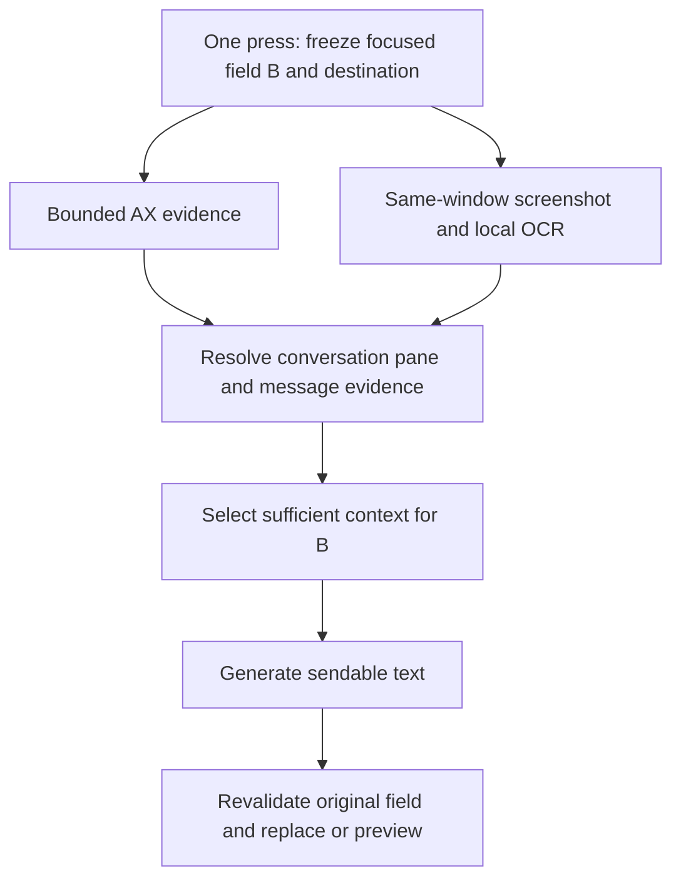

# KeigoButton: context acquisition for one-button intent composition

Recommendation: preserve the native field-capture and insertion machinery, replace the automatic Reply experiment's assumption that a bounded AX tree is sufficient conversation evidence, and test a focused-window AX + screenshot/Vision pipeline. Use a small multimodal model for unresolved layout/message grouping. Make Jev an evaluated optimization after extraction, rather than a required stage. The product operation should be “compose my intention in this conversation,” with the existing field supplying the intention.

This is a proposal, not a change to the shipping product. Main was inspected at `9eeeeb5`; the parked automatic-context implementation was read from `codex/reply-context-experiment` at `1803e03` in `/private/tmp/keigo-reply-experiment`. Shipping automatic capture is hard-off in both configurations. No app code, release flags, account data, provider configuration or deployment was changed. No live screen was captured and no private conversation was replayed to a cloud provider.

The evidence supports a hybrid prototype. It does not yet establish reliable cross-app extraction, live Jev accuracy, or safe automatic replacement.

**What actually failed**

The failures occur at several different boundaries. They should not all be called “AX failed” or “Jev couldn't find the recipient.”

| Evidence | What it establishes | Status of the relevant code |
| --- | --- | --- |
| [First LinkedIn investigation](/Users/itsuki/Desktop/key/laptop/docs/reports/reply-context-linkedin-investigation.md) | The 24-node focus ancestry stopped before the retained window. Navigation and sidebar previews filled 60 text slots and 120 regions. The real composer and main conversation were absent. A broad ancestor still had a focus flag, so the model received mixed sidebar material. | The current reader permits 64 ancestors, prioritizes focus edges, preserves metadata and compacts wrappers. This historical defect should not be presented as still unfixed. |
| [Second LinkedIn capture](/Users/itsuki/Desktop/key/laptop/docs/reports/reply-context-second-capture-analysis.md) | The correct composer/pane was now captured. However, 48 retained history fragments had one-pixel-high rectangles; 16 substantial static-text nodes were discovered after the text buffer filled. This capture reported no AX errors. Routing and audience decisions succeeded; target selection did not. | Current traversal discovers metadata before choosing value reads, filters tiny text and ranks nearby visible evidence. The old evidence-loss mechanism was real, but a larger tree or new model alone was not its remedy. |
| [Third LinkedIn capture](/Users/itsuki/Desktop/key/laptop/docs/reports/reply-context-third-capture-analysis.md) | A useful recent capture was rejected before Jev because one 4-point-wide timestamp-area node had no retained text. The export could not distinguish an empty spacer from an unreadable node. | The [empty-node fix](/Users/itsuki/Desktop/key/laptop/docs/reports/reply-context-empty-node-fix.md) records omission dispositions and exempts confirmed empty values. A failed read remains distinct from an empty read. |
| Recovered Gmail export, examined in this investigation | Full 39/39 focus ancestry; 500 sampled nodes; 56 blocks; 62 regions; 85 ms traversal; one skipped nearby node; `missing_current_history`; **zero provider calls**. Message-body fragments and the inline contact link were present. | This export already contains `textDisposition`, including `empty_text`. It demonstrates a remaining failure shape after the empty-node distinction, not a replay of the same LinkedIn spacer defect. |

The Gmail export is local, private evidence at `.local-recovery/20260925/untracked/reply-diagnostics.json`, snapshot `BDC090EA-D418-4A17-B05C-75ADF0C52BC2`, interpreter revision `capture-v3-turns-1`. It is not the earlier LinkedIn export described in the reports.

Its focused composer is `[337,635,1478,86]` in window coordinates. The sole nearby omission is `n131`, an `AXStaticText` at `[1656,600,87,19]`, with `sample_unreadable`. Its parent chain places it in a narrow right-side group adjacent to a button, above the composer. Its text and purpose cannot be recovered from the export; calling it definitively a particular control would be guessing. Nevertheless, the gate's reason is exact: every unread non-control text node horizontally overlapping the composer within 300 points above it counts as lost current history. A very wide email composer makes that band cover unrelated header/control material as well as the message.

[ConversationTraversal.swift:298](/Users/itsuki/Desktop/key/laptop/Sources/TextIO/ConversationTraversal.swift:298) applies this test to raw text candidates, without first establishing message membership. It rejects if any such node was lost, even when a useful body was retained. [interpreter.ts:429](/private/tmp/keigo-reply-experiment/supabase/functions/desktop-reply-context/interpreter.ts:429) returns before candidate construction or normalization. Better model prompts cannot repair that rejection.

I also ran the production `normalizeTurns` and `buildCandidates` functions locally against the unchanged Gmail export, without a provider call. Normalization produced **34 singleton turns, all with `boundary: unresolved`**. The actual email-body fragments remained separate; the inline `AXLink` was omitted from message bodies. The ownership rule recognizes an `AXGroup` below an `AXList`, `AXOutline` or `AXScrollArea`. This email did not supply an accepted message boundary. Links survive only when that owner exists. The source is [turns.ts:69](/private/tmp/keigo-reply-experiment/supabase/functions/desktop-reply-context/turns.ts:69). This is a latent downstream failure established by offline replay; the recorded Gmail request never reached it.

The recurring pattern is: raw tree fragments are treated as messages; geometry is used as proof of message coverage; uncertainty about incidental fragments can prevent use of the actual message. A chat-list-specific grouping heuristic then fails on email. Further isolated exceptions would preserve the same underlying weakness.

**What still deserves improvement in AX**

AX remains valuable for exact field contents, focus, hierarchy, metadata, and often exact message text. These captures do not prove that browser AX is intrinsically useless: substantial message text was available, and several losses were caused by our traversal/representation.

The present implementation has specific gaps:

- [AXConversationReader.swift:96](/Users/itsuki/Desktop/key/laptop/Sources/TextIO/AXConversationReader.swift:96) traverses only `AXChildren`. It does not probe supported `AXVisibleChildren`, `AXVisibleRows`, `AXRows`, `AXContents` or navigation-order relationships. Selective, role-aware use of these attributes may reach useful evidence earlier. De-duplicate by element identity, preserve ancestry/window ownership, and measure coverage; traversing every relationship indiscriminately would multiply IPC and duplicates.
- Text extraction accepts a narrow set of roles and string attributes. Supported descriptions, attributed text and range-based text access may help particular controls. Add capability probes where evidence shows a gap, rather than assuming every control implements them or reading whole documents by default.
- [AXTextIO.swift:788](/Users/itsuki/Desktop/key/laptop/Sources/TextIO/AXTextIO.swift:788) adds the PID to `manualAccessibilityGranted` **before** attempting the attribute set. A failure therefore prevents later attempts. Focus is read immediately; there is no bounded delayed readiness retry after the frontmost application is primed. Track attempted/result/readiness separately, verify actual tree population, and retry transient failures within a small deadline. A nil immediate focus read is not proof the app will remain opaque.
- The 500-node, 60-block and 12,000-UTF-16-unit limits are not themselves wrong. Their allocation should serve the focused conversation, and omissions should identify which message/region is affected. Budgets must not silently substitute old text or sidebar previews for the current message.
- The one-second traversal limit is a scheduling deadline, not a hard wall-clock bound: synchronous AX IPC can overrun it. Keep IPC off the UI thread, cap in-flight work and log actual latency. An actor does not make blocking IPC cancellable.
- `sample_unreadable` currently loses the top-level `AXUIElementCopyMultipleAttributeValues` error when the complete call fails. Record that error and node identity; zero recorded AX codes is not proof that every read succeeded.

There is also an outdated statement in AGENTS.md §18. It cites Electron #37465 as evidence that current Electron cannot set `AXManualAccessibility`. That issue was closed by [Electron PR #38102](https://github.com/electron/electron/pull/38102), merged April 26, 2023. The patch corrected a misleading failure return; the original error did not necessarily mean the accessibility tree was not enabled. [Current Electron documentation](https://www.electronjs.org/docs/latest/tutorial/accessibility) still documents this third-party activation mechanism. Test the app's actual Electron version and resulting tree rather than treating the old issue as a universal limitation.

`AXEnhancedUserInterface` is a different, private screen-reader-related mechanism. Chromium documents its role in [accessibility activation](https://new.chromium.org/developers/design-documents/accessibility/). Research it in an isolated compatibility experiment, recording tree changes and host behavior; do not globally toggle it as the shipping default. Enabling accessibility cannot manufacture unmounted virtualized history. Launch flags and `app.setAccessibilitySupportEnabled` are useful controls in a test Electron app, but KeigoButton does not own Slack's main process.

**The no-extension options**

| Option | Useful capability | Limitation for this product | Recommendation |
| --- | --- | --- | --- |
| Improved AX | Exact text and focused destination; semantic roles and structure; no screenshot permission | App/version differences, lazy trees, fragmentation, virtualization and cross-process cost | Retain and improve as one evidence source |
| ScreenCaptureKit + local Vision | Visible text even when AX is empty or misleading; coordinates for scope/layout | Needs screen-capture permission; only rendered pixels; text recognition is imperfect; OCR lines are not messages | Add as the complementary source |
| Focused screenshot + small multimodal model | Message boundaries, pane association, quotes, author labels and bubble layout | Cloud latency/cost, image exposure, hallucinated transcription or attribution, no hidden history | Test as grouping/resolution; also test direct screenshot-to-answer as a baseline |
| Rolling local visual memory | Previously visible messages can survive scrolling or an expanded composer | Hard thread binding, stale context, extra energy/privacy burden; cannot recover never-observed content | Second experiment only if press-time evidence is insufficient |
| Official service APIs | Real message/thread IDs and offscreen history | Per-service OAuth/scopes, possible workspace approval, and mapping the visible composer to the correct account/thread | Optional later integrations, not universal acquisition |
| Browser Apple Events JavaScript | DOM access without an extension in supporting browsers | Automation permission plus developer setting; browser-specific; no generic Electron coverage | Useful diagnostic/optional advanced adapter, poor required onboarding |
| CDP / Electron debugging | High-fidelity DOM in a controlled runtime | Debug configuration/relaunch or special profile, app policies, no stable access to ordinary running apps | Research/testing only |

[ScreenCaptureKit's screenshot API](https://developer.apple.com/videos/play/wwdc2023/10136/) fits the app's macOS 14 floor. Bind capture to the retained focused window using `SCContentFilter(desktopIndependentWindow:)`; verify PID, window identity and geometry. Do not choose “largest window of the application.” Resolve a conversation crop from composer ancestry and visible layout, retaining its header and enough history. A fixed rectangle immediately above the field will miss side threads, expanded composers and email headers. Capture before KeigoButton's result/input UI appears.

[Vision text recognition](https://developer.apple.com/documentation/vision/recognizing-text-in-images) supplies observations and text candidates. Keep line/word boxes and recognition confidence. Normalize Vision's coordinates, screenshot pixels and AX screen points into a common window coordinate space, including display scale and crop transforms. Prefer exact AX text when aligned with a visible OCR region; preserve disagreement rather than silently correcting names, dates or numbers. OCR confidence, layout confidence and relevance confidence answer different questions.

A window image represents the rendered window, not all loaded history or everything behind its internal overlays. It cannot reveal an unexpanded email or an unmounted Slack message. Permission refusal and an unreadable/hidden source must remain explicit states. The fallback can use sufficient AX evidence or let the user show/select the source; it must not falsely claim full context.

[Gmail threads.get](https://developers.google.com/workspace/gmail/api/reference/rest/v1/users.threads/get) and [Slack conversations.replies](https://docs.slack.dev/reference/methods/conversations.replies/) are concrete API options, but require authorized access and service IDs. The current signed-in web session does not grant KeigoButton those API permissions. LinkedIn's [open permissions](https://learn.microsoft.com/en-us/linkedin/shared/authentication/getting-access) do not offer a general personal messaging read scope. Local app-specific scripting can be evaluated where officially supported; private message databases, session-cookie extraction and app injection are not a general distribution strategy.

[Chromium's AppleScript documentation](https://www.chromium.org/developers/applescript/) requires the user to enable JavaScript from Apple Events for script execution. [Chrome's remote-debugging change](https://developer.chrome.com/blog/remote-debugging-port) requires a non-default data directory for the port/pipe flags from Chrome 136. Neither is a transparent foundation for the user's existing everyday browser session. No change to these settings was attempted.

**What the supplied references contribute**

| Reference | Useful lesson from source inspection | What it does not establish |
| --- | --- | --- |
| [jev-ultrafast](https://github.com/browser-use/jev-ultrafast) | An indexed, bounded table with descriptive candidates, fresh state and validated choices is a good decision interface. Its default loop uses structured DOM observations, not screenshots. | It does not solve macOS acquisition or demonstrate messaging-context recall. Its documented small demos are not a general reliability benchmark. |
| [vLLM Jev source](https://github.com/mode-io/vllm-jev) | Candidate decisions can be served independently; current source supports compatible text and multimodal checkpoints. | It does not supply a desktop capture layer, prove equivalence to the existing hosted Jev model, or provide a drop-in bundled Mac runtime. The supplied JevList page was inaccessible directly; search exposed its catalog entry and the linked source was inspected. The older Egbertjing URL currently redirects here. |
| [AppShot core](https://github.com/Shiyao-Huang/appshot/blob/main/Sources/AppShotCore/AppShotCore.swift) | Richer role-aware AX child relationships, activation diagnostics, window metadata and OCR with boxes are useful examples. | Its optional browser/Electron bridges conflict with this product's installation constraint. Core screenshot capture shells out to `screencapture`; it also aggressively sets enhanced-UI attributes. Neither should be copied wholesale. Its inspected OCR language list omits Japanese. |
| [Marigold perception](https://github.com/frgmt0/marigold/blob/main/Sources/Marigold/Perception/PerceptionActor.swift) | A bounded perception boundary and event/settling gates are useful. | OCR is triggered by insufficient AX text length, which would miss our “lots of wrong text” failure. Its harvester flattens/deduplicates strings, losing message identity. Its FoundationModels/macOS 26 requirement also differs from our floor. |
| [Open Chronicle capture](https://github.com/Screenata/open-chronicle/blob/main/app/Sources/CaptureManager.swift) | A concrete local OCR/memory implementation to compare for a later cache experiment. | Its inspected implementation skips captures when app/window-title is unchanged, uses full-screen CoreGraphics capture, flattens OCR, stores screenshots and excludes messaging apps by default. It is not evidence of same-thread messaging recall. |
| [codex-computer-use-cli capture](https://github.com/paralym/codex-computer-use-cli/blob/main/Sources/CodexCUCore/Capture/ScreenCapture.swift) | Demonstrates combining a window screenshot and AX observations without a browser extension. | Its window fallback chooses the largest matching window and assumes 2× scale; its AX walker caps list children at the first 30. Those assumptions are unsuitable for our destination-sensitive workflow. Its input/private window-masking machinery is unnecessary here. |
| [Screen2AX](https://arxiv.org/abs/2507.16704) | Research support for recovering structure from visual evidence when native AX is inadequate. | Its general accessibility-tree benchmark does not establish message grouping, author attribution or reply accuracy. Reconstructing an entire AX tree is more work than this product needs. |

**Proposed architecture**

This is a flow of responsibilities, not a requirement for a separate model call at each node. In the first prototype, collect AX and pixels together on every explicit press so their differences can be measured. For production, skip OCR/cloud vision only when measured checks demonstrate sufficient relevant AX evidence. “Nonempty AX text” is not that check.

1. **Freeze B and its destination before focus changes.** Read the whole communication field as rough intention, keeping it separate from conversation A. Preserve its original value/range for changed-field detection and undo. Exclude the field and other drafts from context extraction. Reject password/search fields as communication destinations. Handle IME composition and rich-text/signature cases explicitly during validation. If the field cannot be read safely, understanding the screenshot does not authorize replacing it.
2. **Acquire coherent evidence.** Retain app/process, focused window, composer handle/bounds and a capture epoch; recheck them after async acquisition. AX and screenshot calls are not atomic, so discard/retry a sample that changed during acquisition. Preserve window-relative geometry, source IDs, observation time, read omissions and visible/partial status. If a public window match is ambiguous, abstain instead of guessing from title alone.
3. **Recover only the conversation associated with that field.** Use AX ancestry first, with pixels as independent evidence of pane boundaries and actual visibility. Preserve multiple possible panes until resolved. A targeted AX hit-test can supplement an OCR-identified region without clicking, but it must be bound back to the same window; Apple's [hit-test API](https://developer.apple.com/documentation/applicationservices/1462077-axuielementcopyelementatposition) respects z-order and can otherwise return another window. Do not scrape the whole desktop into a text blob.
4. **Construct message evidence, not a fake complete transcript.** Each candidate needs exact AX/OCR source references, text fragments, bounds, pane membership, timestamp of observation, completeness and optional author/quote/timestamp evidence. Keep author unknown when absent. Preserve identical messages as separate instances. A small multimodal model may associate fragment IDs with message groups and headers; validate references and reconstruct text from the captured fragments. If transcription is unavoidable, label its provenance instead of pretending it was exact AX text. A visible partial long email may be sufficient for one intention and insufficient for another.
5. **Select using B.** The current interpreter accepts captured evidence but not user intention, and chooses exactly one immediate incoming anchor. Its background questions therefore cannot answer “which messages matter for this intention.” Add intention to the selection state and permit several related messages, a follow-up to the user's own earlier message, or no incoming anchor when B is self-contained. Pane/destination association remains stronger than semantic similarity to an unrelated sidebar preview. Do not require every speaker name or every old turn to be resolved. Block on material recipient/request uncertainty, not any unread nearby node.
6. **Generate and revalidate.** The writer takes A as untrusted evidence and B as the user's instructions/facts. It should infer phrasing, not unsupported commitments. Preserve output language rules independently from instruction language. At replacement, confirm the original field, conversation and captured B are still current. An unchanged PID or identical empty composer is not enough when the user switches threads. On uncertainty, retain the result for copy/preview rather than automatically redirecting it to a newly focused field. Never press Send.

Jev should initially compete against a simple bounded recent-message set and the multimodal model's own relevance selection. If only a handful of relevant messages remain, sending them to the writer may beat another network round trip. If Jev improves precision or cost, let it choose among already-grounded message IDs using B. Do not ask it to recover missing text, simultaneously invent grouping and choose recipients, or interpret its top-two margin as calibrated probability of correctness. The existing 0.10 margin policy needs evaluation on this task. [Gemini's image-understanding interface](https://ai.google.dev/gemini-api/docs/image-understanding) supports the visual baseline; the actual model/version should be pinned for comparison rather than chosen from a generic speed claim.

For longer-term architecture, keep capture/grouping provenance even if a combined multimodal request both selects context and produces the answer. That makes mistakes attributable without forcing two or three provider calls for every successful press.

**Keep, replace and simplify in this repository**

| Keep | Change or simplify |
| --- | --- |
| Never-key pill, capture-before-focus ordering, owning-screen geometry | One experimental action reads intention directly from the host field; no separate guidance field in the successful path |
| AX/clipboard write separation, captured destination, write verification, clipboard recovery | Strengthen same-conversation and unchanged-B checks for one-press replacement; do not reuse automatic redirect as success |
| Platform resolver and focused-input detection | Treat platform as a scope/format hint, not proof of conversation identity |
| ReplySession cancellation, snapshot binding and diagnostic export concepts | Replace “captured → rigid incoming anchor → ready” with evidence sufficiency for this intention; reacquire on stale/missing evidence |
| Source IDs, exact-source validation, selected messages separated from audience | Add OCR provenance, temporal/coordinate metadata and layout-derived grouping; replace list-only normalization |
| Existing desktop auth, provider gateway and generation service | Introduce an explicit desktop intent-composition contract rather than silently redefining existing draft/rewrite fields |
| Existing result surface for the first trial | Test direct replacement plus undo only after capture, selection and changed-field behavior pass |

Leave the extension bridge parked and bypass it in the new no-extension experiment. Do not delete saved buttons, migrate user configurations or change the shipping release while testing this product direction. If evidence supports launch, revise AGENTS.md's product and deferred-OCR guidance then. The new user experience can be one operation while the implementation still distinguishes intention, evidence, destination and generation internally.

The current backend may retain rewrite input/output and selected reply-source text. Screenshots, OCR buffers, background messages and cache contents must not accidentally inherit that logging path. Keep provider credentials behind the existing authenticated desktop gateway, send only bounded needed context, and make screenshot use clear in permission/product copy. Normal operation should keep temporary frames in memory; explicit development exports can remain local and reviewed. This is a concrete consequence of adding pixels, not a reason to expand the backend schema for the prototype.

**Rolling context: defer until measured necessary**

A press-time screenshot cannot recover the message the user read and then scrolled away from. If that becomes a leading failure, add a short in-memory ring of foreground communication-pane observations, sampled on meaningful settled changes rather than constant high-rate recording. Start with a small byte/frame cap and a 30–90-second experiment window. Cache before the composer gains focus as well as while it is focused, since reading often precedes typing.

Bind entries to process instance, window, conversation/header evidence and composer association where available. Browser PID/window title alone is insufficient. Invalidate or quarantine on navigation, thread/account change, lock and uncertain identity. Keep original text/boxes and timestamps; do not make an LLM summary the source of names, numbers or commitments. Admit older evidence only when it matches the current conversation; never use it merely because it is recent. Measure incremental recall and thread-contamination risk before deciding to ship background capture.

**Smallest prototype with useful evidence**

Build one development capture harness on the existing experiment branch, with the browser bridge disabled. Reuse the current target capture, AX traversal and source export. Add only a focused-window screenshot provider, a local Vision adapter preserving boxes, and a replay/evaluation adapter. Initially return a preview through the existing result surface. No scrolling automation, API integrations, rolling cache, new onboarding or universal AX-tree reconstruction is needed.

Capture the same scene once and compare four paths:

| Path | Question answered |
| --- | --- |
| Current AX + current grouping | Reproducible baseline, including its existing abstentions |
| Improved AX + wake/readiness and alternate relationship probes | How much can local acquisition fixes recover without pixels? |
| Screenshot + B into one small multimodal call | Does the simplest visual solution already solve the narrow task? |
| AX + OCR boxes + image + B, with validated grouping/selection | Does the extra structure improve attribution, exact facts, cost or debuggability? |

Evaluate optional Jev ranking on the same resulting message candidates afterward; do not vary acquisition, grouping and scorer simultaneously. Use anonymized or explicitly approved conversations for any cloud evaluation.

Start with 40 labeled scenarios: 12 Gmail (inline, long email, quotes and pop-out), 12 LinkedIn (full pane, messaging overlay, sidebar distractions), 12 Slack (browser and Electron, including channel plus side thread), and four native-app controls. Include unreadable/hidden-source cases in the set, not only easy successes. Vary Japanese/English/Chinese, zoom, display scale, multiline intentions, earlier-message references, self-authored follow-ups, two plausible panes and mid-generation thread/field changes. Keep a held-out subset and report each app separately. Add Safari/other supported browsers before claiming broad browser support.

Label the actual conversation, the minimum required A for B, message boundaries, critical facts and whether the source is recoverable from the observation at all. Measure separately:

- Recovery of required evidence and exclusion of other conversations.
- Correct grouping, quote/author attribution, and preservation of critical names/numbers/dates/negation.
- Relevance-selection quality with and without Jev.
- Whether the answer fulfills B without inventing facts, and whether the user accepts or edits it.
- Capture/model/total latency, provider calls, payload size/cost, and every abstention reason.
- Changed-field refusal, insertion into the original destination, and restoration/undo behavior.

Suggested initial go/no-go targets, not achieved results: at least 95% required-evidence recovery on cases where A is visible; zero wrong-conversation selections or overwrites in the test set; no unsupported critical commitments; capture p95 below 1.5 seconds and end-to-end p95 below 4 seconds on the test machine/network. Forty cases can reject a bad approach but cannot establish a production safety rate. Expand validation before replacing the shipping experience. If most failures are hidden/previously visible A, test the bounded cache next; if they are visible text/layout errors, fix extraction/grouping first.

**Additional offline evidence from this investigation**

I ran Apple's `VNRecognizeTextRequest` locally on the existing 1920×1080 files `log/linkedin.png` and `log/email.png`, using accurate recognition, Japanese/English/Simplified Chinese, and language correction off. One run each produced 124 and 85 observations in approximately 989 ms and 441 ms, respectively, excluding Swift startup/compilation. Visual comparison showed recovery of the visible Japanese message bodies, including the LinkedIn deadline information and Gmail's reply restriction. Small symbols/emoji were misrecognized. These two files are not synchronized screenshot/AX pairs and do not establish grouping accuracy, all-language quality, live capture overhead or a latency percentile.

The private OCR outputs and probe are under `/tmp/keigo-context-research/`; only structural findings are recorded here. Production-code normalization was replayed locally without modifying the saved capture. Existing reports supplied historical LinkedIn/server evidence; no new live backend log query, provider replay, native UI test or insertion test was performed. The prototype above is the next evidence-gathering step, not an implemented feature.
