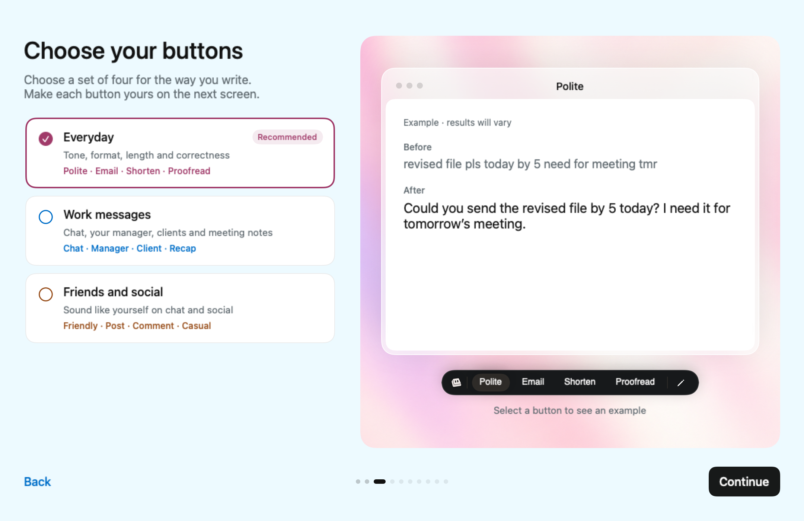
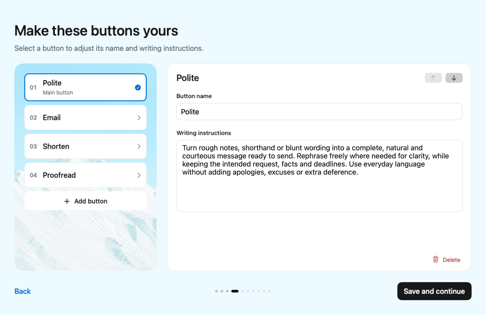

# Three purpose sets and independent desktop buttons

The selection page offers Everyday (recommended), Work, and Friends & Social, each
with four buttons. This replaces the earlier interpretation of one four-button set.
Japanese and English retain their approved main instructions and examples; Chinese
interface guidance uses the Japanese button catalog. Retired packs still decode.

Purpose cards use pink, blue and orange accents. The supplied `public/pink.png`,
`public/blue.png` and `public/orange.png` are bundled as AsidePink/Blue/Orange and fill
the matching bounded stages. A glass-framed white demo window has quiet centered
chrome, without the former title accent stripe. The compact 34 pt dark preview bar
uses the product keycap and pencil at its ends; four selectable buttons update the
example. The editor has an identity-bound heading, name and instruction fields,
and a fixed bottom-right Delete label with trash icon, without a footer separator. Deleting selects the next adjacent item, or the preceding last item; at least
one button remains. Examples stay off the customization page.

## Storage and account behavior

`public.desktop_user_prompts` is now deployed. Migration
`20260926032830_desktop_user_prompts` copied 229 rows for 57 accounts already recorded
in `desktop.activations`. IDs, text, origins, builtin keys, enabled states, order and
timestamps matched the original rows exactly immediately after migration. Phone rows
and signup triggers were not changed. The table-existence guard makes the snapshot a
one-time operation, including if the migration SQL is accidentally rerun.

All desktop CRUD paths use the new table; there is no phone-table fallback. New users
and iPhone-only accounts start without desktop rows. Keep my current buttons appears
only for signed-in accounts with successfully loaded nonempty desktop configurations.
Returning users default to current buttons unless resuming their own unfinished draft.

Drafts are namespaced by account ID; old unowned drafts are ignored. Account switches
clear visible drafts, while back navigation and restart preserve same-account edits.
Read failures block continuation and expose Retry, including on a resumed review page.
Tutorial replay never saves button drafts or writes remote replacements.

## Validation

- Debug native build succeeded, code signing disabled. The subsequent pink/blue/orange
  UI refinement was rebuilt and rendered at 1080 × 700; all three color stages, the
  compact product bar, Japanese email layout, and borderless Delete control were
  visually checked. No behavior or storage changes were made in that refinement.
- 96 focused Swift tests passed: onboarding, localization, preset examples, stock
  recognition, account-scoped persistence, identity preservation and storage CRUD.
- The offline native `--verify-saved-buttons` harness passed: Save/reload, failed Save,
  blank validation, enabled state, coalesced reordering, Add/Delete, stale account
  responses, returning/new onboarding defaults, interrupted drafts, account switching,
  failed reads/retry and replay persistence.
- Rendered and visually reviewed 45 native 1080 × 700 fixtures: all 36 button examples
  across three interface languages, returning users, normal editors and seven-button
  editors with long names. Overflowing examples/lists scroll within fixed bounds.
- Existing Reduce Motion behavior and opaque text surfaces remain; selected state also
  uses shape/checkmarks, and delete/reorder controls have accessible labels. OS-level
  accessibility display switches were not toggled during verification.
- Before deployment, transaction-and-rollback checks proved the copy matched, rerunning
  the migration preserved the desktop snapshot, and phone rows were unchanged.
- On the deployed table, transactional CRUD checks proved owner read/create/update/delete,
  rejected ownership reassignment and cross-account writes, hid other owners' rows,
  and denied anonymous access. Test mutations were rolled back.
- Security advisors reported no finding for `desktop_user_prompts`; existing unrelated
  project findings were unchanged in scope. `git diff --check` passed.

No app release or rewrite-function deployment was performed. Older app binaries still
use shared phone storage; the updated build uses the independent snapshot. Prompt
quality changes from the preceding task remain a separate, undeployed function change.
